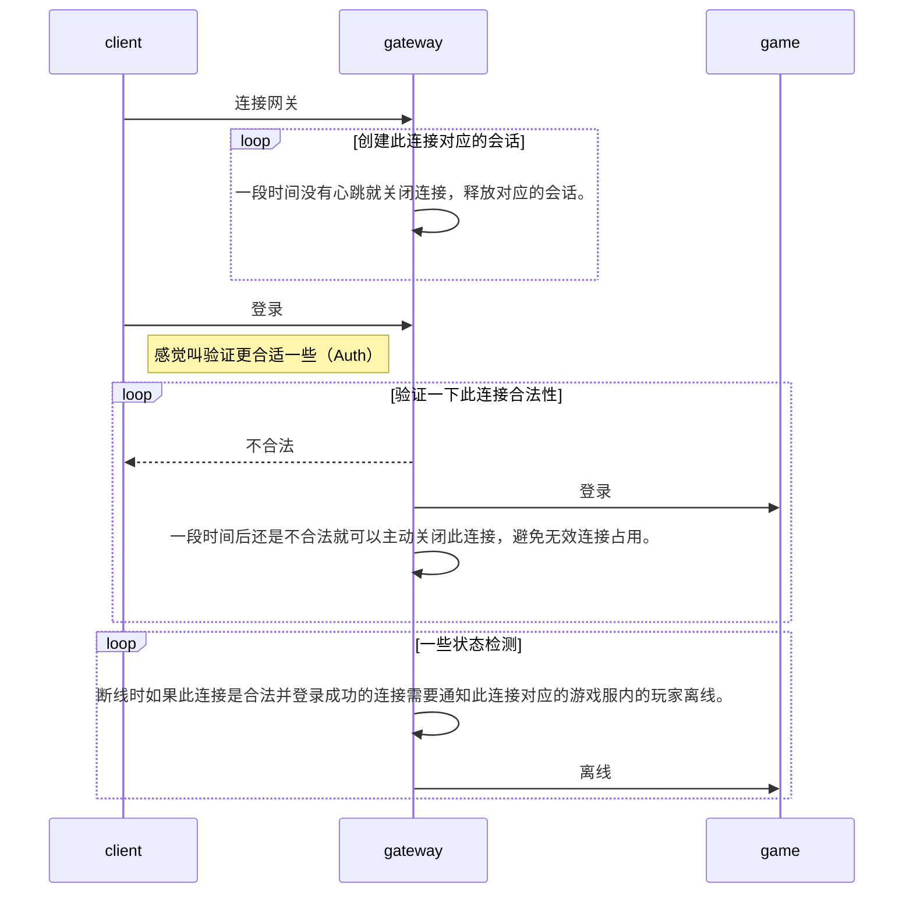

假设一套游戏服务器只有gateway和game，毕竟断线重连与登录只涉及到这两块。

客户端app登录时首先会连接网关，网关收到连接需要创建一个针对这个连接的会话，用于处理针对这个连接的逻辑，比如消息加密解密，登录验证，心跳检测（还可用于NTP时间效正），心跳检测到10分钟没有消息时就主动断开连接，当网关触发断开连接时就可以释放对应的会话，同时通知游戏服此连接对应的玩家离线。总的来说网关只负责做一下客户端会话管理，以及消息合法性验证，玩家登录时会发一个登录包，告诉服务器我要进入游戏了，网关会通过这个登录包中的token字段验证此连接是否合法，如果合法就做个标记说明此连接合法，同时通知game有玩家登录，接下来收到此连接的消息就可以放行转发给game，算是个看门狗，使用skynet的开发者习惯叫这个模块watchdog。

所以game这边相对网关只需要两种数据包就够了，一个是玩家登录包，一个是玩家离线包；那断线重连的时候怎么办，断线重连其实也是登录，重连后客户端同样需要发登录包给网关进行链接合法性验证，然后game这边收到玩家登录包就通过其中的uid查找对应的game服中对应的会话数据，如果没查到，那创建会话并初始化为登录状态，否则发现是离线状态那就更新为登录状态。检测到离线持续10分钟就可以释放玩家在游戏中的数据并选择性的存档。

那如果客户端检测到网络断开了，然后5s后进行重连，服务器一直没检测到断开，这种情况下会出现相对一个客户端有两个连接在服务器的情况怎么处理？如果新连接过来，并验证登录成功了，那我就就告诉旧的连接你被踢了，发个踢下线的包过去，我才是有效合法的，然后延迟1s后把旧连接断开，参见[#延迟断开原因](#reason.delayed_disconnection)，然后这里需要等旧连接断开后再通知game有玩家登录，避免game收到玩家登录包后又收到离线包，可玩家没离线，所以必须先发离线包才能接着发登录包。正常重连的话客户端检测到网络关了才重连的，既然旧连接网络关了，所以也不会收到被踢的消息了，只有真正被踢的时候才会收到，这块服务器不需要做特殊处理。当被真正顶下线的时候旧的那一端会收到被踢下线的包，然后客户端需要处理如果收到被踢的消息，那再断线就不用去重连，避免另一端又被踢下线导致互相踢死循环的情况。

这里针对个人情况描述一下核心的流程，具体需求以及优化方案就根据自己实际情况补充。

##### 延迟断开原因

这里延迟断开的原因是避免客户端收不到被踢的消息，向客户端下发消息后立即关闭连接为什么会导致客户端收不到消息，不过也不是百分之百会收不到。单纯看tcp的四次挥手流程确实是不存在这种情况的，而且一般业务层没有缓冲区的话，socket是block还是notblock，直接调用write，只要成功了，紧接着关闭socket，客户端肯定可以收到消息 + fin；不过现实情况对于服务器而言，一般都是notblock socket fd，尝试write，write失败了，就把消息放入缓冲区，如果这个时候close fd，客户端肯定收不到。这也是tcp选项SO_LINGER存在的意义，参见[#SO_LINGER](https://breezetemple.github.io/2019/07/04/tcp-option-SO-LINGER/)。
